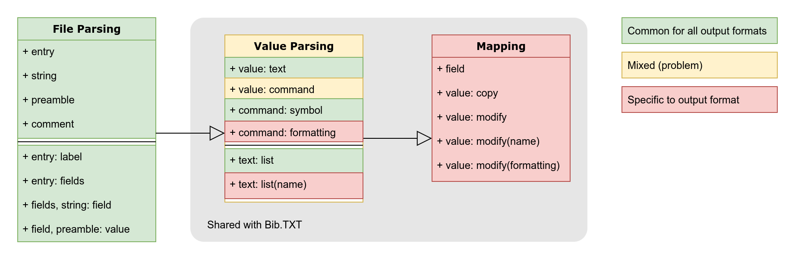

# BibTeX Parser Experiments

Experiments to determine the new BibTeX parser formula. The result may be applied
to other formats as well in the future.



Above is some pseudo-grammar describing the stages of parsing. The reason I
distinguish between parsing the file and parsing values is best demonstrated in
the "entry value with mid-command concatenation" test case:

Input:
```bibtex
@book{a,
  title = "foo \\copy" # "right{} bar"
}
```

Output:
```js
[{
  type: 'book',
  id: 'a',
  properties: {
    title: 'foo © bar'
  }
}]
```

## Participants

Note: `idea` (Citation.js Idea #1) and `nearley` are skipped in some tables, as
they are only in here for historic reasons.

### Citation.js (old) → "current"

At the time of starting these experiments, the `TokenStack` class was utilized,
together with a simple RegExp that tokenizes commands.

### Citation.js Ideas

The idea was to explore tokenization without introducing a formal grammar, as
formal grammars introduce extra build steps, runtime dependencies and large swaths
of generated code. However, used as I was to the syntax of `PEG.js` and `nearley.js`,
I made some unnecessarily complicated features like `consumeAnyRule()`, and some
weird loops in the rules. This was partly due to bad tokenization.

Idea #2 ("idea-reworked") has new tokens, a simpler `Grammar` class and simplified
rules. It also has more features, including more commands and diacritics, including
more ways to write them.

### Citation.js with nearley

In parallel to reworking the idea, I used the tokenizer in a `nearley.js` grammar,
which failed miserably. This is probably the result of bad grammar-writing on my
part, and not a reflection of the capabilities of `nearley.js`. However, an additional
downside of this route is that it introduces an extra build step (`nearleyc`) and
a runtime dependency — `nearley` itself.

### astrocite

The `astrocite-bibtex` package by @dsifford uses PEG.js. It is capable of returning
an AST.

### fiduswriter

Fiduswriter's `biblatex-csl-converter` seems to perform very poorly on the larger
file. However, it does return lossless values, although I am not a fan of the
(lack of) difference between arrays representing single and multiple values:

```js
[
  { type: 'text', text: 'foo' }
]
// vs
[
  { literal: [{ type: 'text', text: 'foo' }] },
  { literal: [{ type: 'text', text: 'bar' }] }
]
```

This causes testing such as

```js
literal in value[0]
// or more properly
value.every(part => literal in part)
```

### Zotero

Zotero Translators are relatively hard to use stand-alone, as they depend on a
Zotero framework in the global scope. It immediately converts to Zotero API JSON
while parsing the syntax. Not shown in the performance table is that Zotero
requires initialization, not counting the time it takes to import files, and that
this takes relatively long.

### Better BibTeX for Zotero (BBT)

Using `@retorquere/bibtex-parser`, this performs very well. It is capable of
returning an AST. I have not had a chance to test out all the parser features
for literal/text/name values yet.

## API Features

| | current | idea-reworked | astrocite | fiduswriter | zotero | bbt |
|-|---------|---------------|-----------|-------------|--------|-----|
| Sync/Async | sync | sync | sync | both | async | both |
| AST output | ✘    | ✘    | ✓    | ✘    | ✘     | ✓    |
| Lossless schema¹ | ✓ | ✘ | ✓    | ✓    | ✘     | ✓    |
| Lossless values  | ✘ | ✘ | ✘    | ✓    | ✘     | ✓    |
| Error recovery | ✓ | ✘   | ✘    | ✓    | ✘     | ✓    |

¹ specifically the schema used to represent data entries and not value
  syntax (commands, formatting), and disregarding AST

## Syntax Features

Empty cells indicate a choice to follow either natbib or biblatex for
certain behavior, this becomes clear from context. If both cells are
empty, this is may be an error, but that should be indicated by a
different test fixture. Auto-generated by `npm run features -- fixtures`,
see also [the fixture file](test/fixtures/features.js).

| | current | idea-reworked | astrocite | fiduswriter | zotero | bbt |
|-|---------|---------------|-----------|-------------|--------|-----|
| entry with lowercase type | ✓ | ✓ | ✓ | ✓ | ✓ | ✓ |
| entry with mixed-case type | ✓ | ✓ | ✓ | ✓ | ✓ | ✓ |
| entry with uppercase type | ✓ | ✓ | ✓ | ✓ | ✓ | ✓ |
| entry with parentheses | ✘ | ✓ | ✓ | ✓ | ✓ | ✓ |
| entry with spacing | ✓ | ✓ | ✘ | ✓ | ✘ | ✓ |
| string key with colon | ✘ | ✓ | ✘ | ✓ | ✘ | ✓ |
| entry key with colon | ✓ | ✓ | ✓ | ✘ | ✘ | ✓ |
| entry label with number | ✓ | ✓ | ✓ | ✓ | ✓ | ✓ |
| entry label with colon | ✓ | ✓ | ✓ | ✓ | ✓ | ✓ |
| entry label with double quotes | ✘ | ✓ | ✓ | ✓ | ✓ | ✓ |
| entry value of quoted string | ✓ | ✓ | ✓ | ✓ | ✓ | ✓ |
| entry value of braced string | ✓ | ✓ | ✓ | ✓ | ✓ | ✓ |
| entry value of number | ✘* | ✘* | ✓ | ✘* | ✘* | ✓ |
| entry value with mid-and concatenation | ✘* | ✓ | ✘* | ✓ | ✘* | ✓ |
| entry value with mid-command concatenation | ✘* | ✓ | ✘* | ✘* | ✘* | ✘* |
| TODO |   |   |   |   |   |   |
| string with lowercase type | ✘ | ✓ | ✓ | ✓ | ✓ | ✓ |
| string with mixed-case type | ✘ | ✓ | ✓ | ✓ | ✓ | ✓ |
| string with uppercase type | ✘ | ✓ | ✓ | ✓ | ✓ | ✓ |
| string with parentheses | ✘ | ✓ | ✓ | ✓ | ✓ | ✓ |
| string value with string | ✘ | ✓ | ✓ | ✓ | ✘ | ✓ |
| string value with concatenated string | ✘ | ✓ | ✘ | ✓ | ✘ | ✓ |
| preamble with quoted string | ✘ | ✓ | ✓ | ✓ | ✓ | ✓ |
| preamble with string | ✘ | ✓ | ✘ | ✓ | ✓ | ✓ |
| preamble with concatenated string | ✘ | ✓ | ✘ | ✓ | ✓ | ✓ |
| comment before entry | ✘ | ✓ | ✓ | ✓ | ✓ | ✓ |
| comment around entry (natbib) |   | ✓ |   |   |   |   |
| comment around entry (biblatex) |   |   | ✓ | ✓ | ✓ | ✓ |
| sentence-casing | ✘ | ✘ | ✘ | ✘ | ✘ | ✓ |
| markup | ✘ | ✘ | ✘ | ✘ | ✘ | ✓ |
| literal names and biblatex extended names | ✘ | ✘ | ✘ | ✘ | ✘ | ✓ |
| verbatim fields | ✓ | ✘ | ✘ | ✘ | ✘ | ✓ |
| diacritics and subscript | ✘ | ✘ | ✘ | ✘ | ✘ | ✓ |
| multi-argument commands | ✘ | ✘ | ✘ | ✘ | ✘ | ✓ |
> * gimmicks, either trivial or not relevant

## Performance

Data from `npm run benchmark`.

|                       | Time (single entry) | Time (3345 entries) |
|-----------------------|--------------------:|--------------------:|
| Citation.js (old)     |             1.495ms |              2795ms |
| Citation.js (idea #1) |             0.521ms |              1700ms |
| Citation.js (idea #2) |             0.736ms |              1471ms |
| astrocite (PEG.js)    |             1.018ms |              2784ms |
| fiduswriter           |            14.912ms |            146766ms |
| Zotero                |            25.797ms |             35427ms |
| Better BibTeX (BBT)   |             1.692ms |             21072ms |
